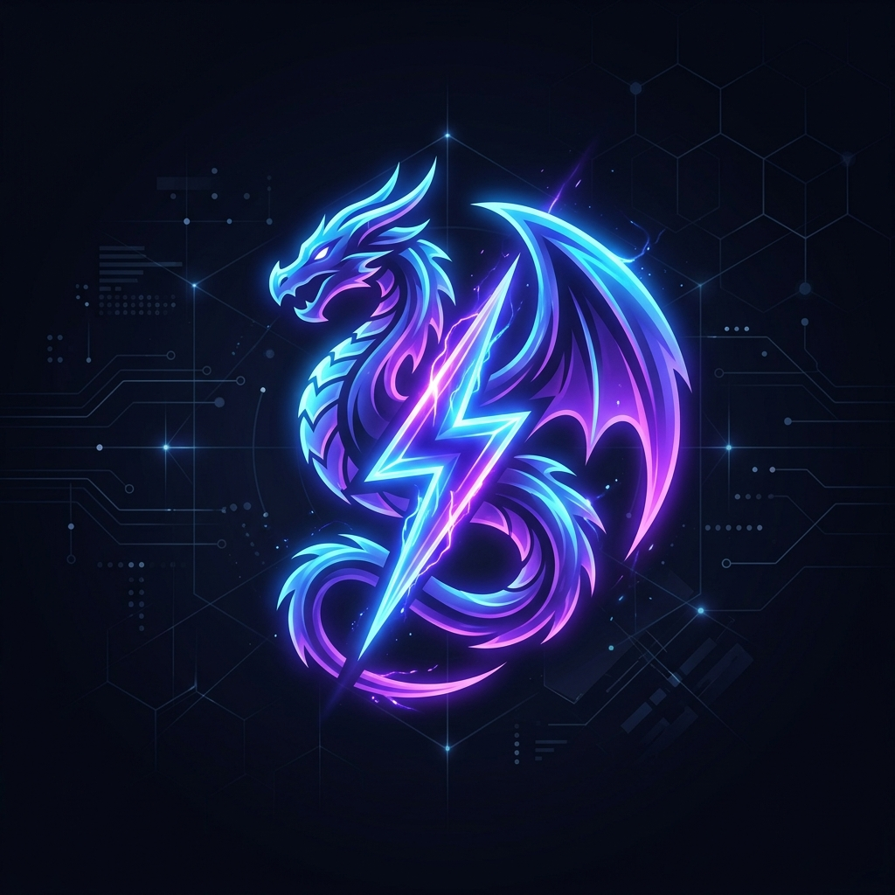
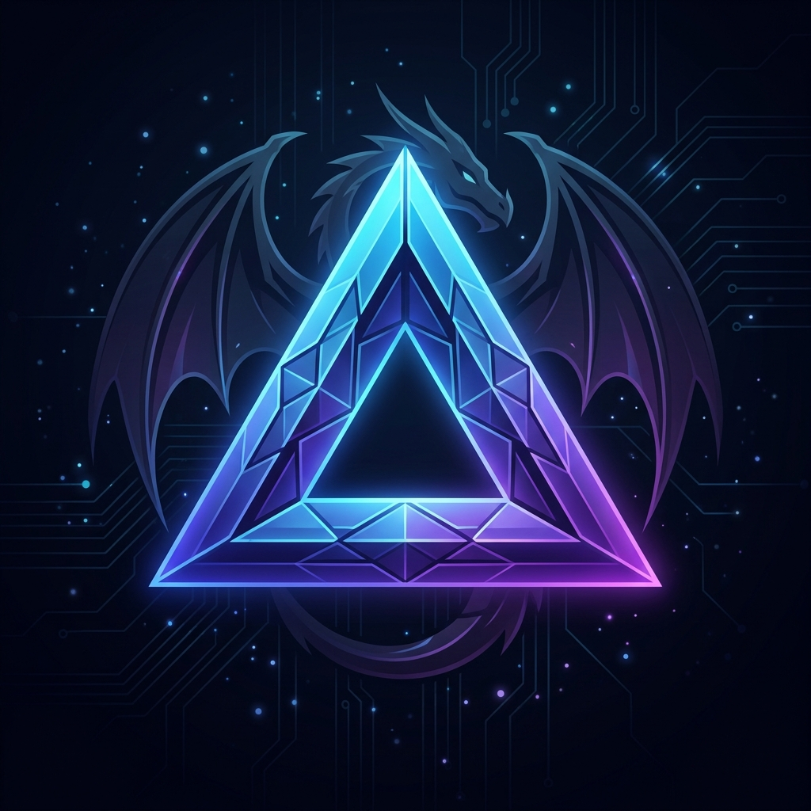

<div align="center">
  

  # 🐉 DragoEvent
  
  **Event Monitoring Reimagined**  
  *Track user activities, sales, and system alerts instantly with seamless Discord integration.*

  [Live Demo](#) · [Report Bug](#) · [Request Feature](#)
</div>

---

## ✨ Features

- ⚡ **Lightning Fast:** Receive events instantly without any delay using our highly optimized Next.js 15 infrastructure.
- 💬 **Discord Native:** Get beautiful, formatted push notifications directly to your Discord server or DMs.
- 🔐 **Secure API:** Your events are protected with encrypted API keys and private delivery status tracking.
- 💳 **Stripe Integration:** Built-in PRO tier upgrades with automated quota enforcement.
- 📱 **Responsive Dashboard:** Manage your API keys, categories, and track usage through a sleek, mobile-friendly interface.

---

## 🛠️ Tech Stack

<div align="center">
  
</div>

- **Framework:** [Next.js 15](https://nextjs.org/) (App Router)
- **Styling:** [Tailwind CSS](https://tailwindcss.com/) & [shadcn/ui](https://ui.shadcn.com/)
- **Database ORM:** [Prisma](https://www.prisma.io/)
- **Database:** [Neon](https://neon.tech/) (Serverless Postgres)
- **Authentication:** [Clerk](https://clerk.dev/)
- **Payments:** [Stripe](https://stripe.com/)
- **Notifications:** Discord Webhooks / Bot API

---

## 🚀 Getting Started

### Prerequisites

Ensure you have Node.js 18+ installed on your machine.

### Installation

1. **Clone the repository:**
   ```bash
   git clone https://github.com/yourusername/event-drago.git
   cd event-drago
   ```

2. **Install dependencies:**
   ```bash
   npm install
   ```

3. **Set up environment variables:**
   Create a `.env` file in the root directory and add the following keys:
   ```env
   # Database (Neon/Postgres)
   DATABASE_URL="your_database_url"

   # Authentication (Clerk)
   NEXT_PUBLIC_CLERK_PUBLISHABLE_KEY="pk_..."
   CLERK_SECRET_KEY="sk_..."
   NEXT_PUBLIC_CLERK_SIGN_IN_URL=/sign-in
   NEXT_PUBLIC_CLERK_SIGN_UP_URL=/sign-up
   NEXT_PUBLIC_CLERK_SIGN_IN_FALLBACK_REDIRECT_URL=/welcome
   NEXT_PUBLIC_CLERK_SIGN_UP_FALLBACK_REDIRECT_URL=/welcome

   # Discord Bot
   DISCORD_BOT_TOKEN="your_discord_bot_token"

   # Payments (Stripe)
   STRIPE_SECRET_KEY="sk_test_..."
   STRIPE_WEBHOOK_SECRET="whsec_..."
   NEXT_PUBLIC_BASE_URL="http://localhost:3000"
   ```

4. **Initialize the database:**
   ```bash
   npx prisma generate
   npx prisma db push
   ```

5. **Run the development server:**
   ```bash
   npm run dev
   ```

Open [http://localhost:3000](http://localhost:3000) to view it in your browser.

---

## 📡 API Usage

Sending an event is as simple as making a POST request to the API:

```javascript
await fetch('https://your-domain.com/api/v1/events', {
  method: 'POST',
  headers: {
    'Authorization': 'Bearer <YOUR_API_KEY>'
  },
  body: JSON.stringify({
    name: 'user_signup',
    formattedMessage: 'A new user just registered!',
    fields: {
      email: 'user@example.com',
      plan: 'FREE'
    }
  })
})
```

---

## 📄 License

This project is licensed under the MIT License - see the [LICENSE.md](LICENSE.md) file for details.
